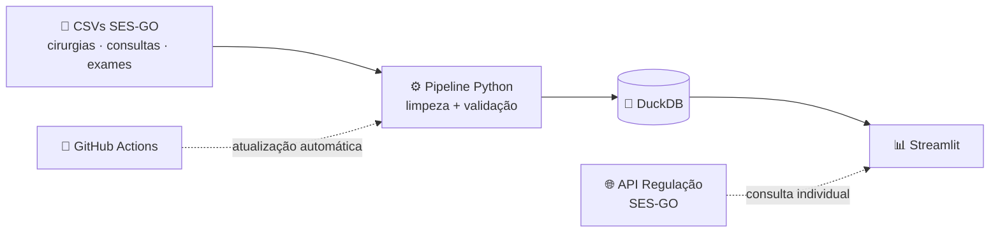

<div align="center">

# 🏥 Filas da Regulação em Goiás

**Painel interativo sobre as filas de cirurgias, consultas e exames da rede estadual de saúde de Goiás.**


[🔗 Acessar o painel](#) · [📚 Documentação](docs/README.md) · [🗺️ Roadmap](#roadmap)

</div>

---

## 📌 Sobre o projeto

Quem precisa de uma cirurgia, consulta especializada ou exame pelo SUS em Goiás passa pela **regulação**, que organiza as filas e distribui as vagas da rede estadual. A Secretaria de Estado da Saúde (SES-GO) publica indicadores mensais dessas filas, mas eles chegam em planilhas grandes e difíceis de ler.

Este projeto transforma esses dados em um **painel interativo** para responder perguntas como:

- ⏳ Quanto tempo, em média, se espera por especialidade? A espera está aumentando ou diminuindo?
- 📍 Como a oferta e o aproveitamento de vagas variam entre regiões e unidades de saúde?
- 🚫 Quantas vagas se perdem, seja por não serem preenchidas, seja por falta do paciente?
- 🔎 Qual é a **minha** posição na fila? *(consulta individual pela API oficial da SES-GO)*

> 🚧 **Projeto em construção.** Também é um projeto de estudo: o plano, as decisões e as referências ficam em [`docs/`](docs/README.md).

## 🧱 Arquitetura



| Camada | Tecnologia | Por quê |
|---|---|---|
| Armazenamento | **DuckDB** | Banco analítico **embarcado**: roda dentro do app, sem servidor, e é rápido para agregações |
| Pipeline | **Python** | Leitura, limpeza, validação e carga dos dados brutos |
| Visualização | **Streamlit** | Painel interativo publicado no Streamlit Community Cloud |
| Consulta individual | **API REST da SES-GO** | Posição do paciente na fila em tempo real |
| Automação *(planejada)* | **GitHub Actions** | Atualização periódica dos dados sem intervenção manual |

## 📂 Dados

| Conjunto | Registros (aprox.) | Detalhamento |
|---|---|---|
| Cirurgias | 6,6 mil | Mês × especialidade: pacientes em fila, tempo médio de espera, procedimentos realizados |
| Consultas | 17 mil | Mês × central × unidade × especialidade: vagas, agendamentos, comparecimento, perdas |
| Exames | 9 mil | Mês × central × unidade × grupo de exames: vagas, agendamentos, comparecimento, perdas |

**Fonte:** Secretaria de Estado da Saúde de Goiás (SES-GO), via [Portal de Dados Abertos de Goiás](https://dadosabertos.go.gov.br/pt_BR/dataset/transparencia-regulacao-indicadores)
**API:** [Regulação Transparência API](https://api.regulacao-transparencia.saude.go.gov.br/)

## 🔒 Privacidade

A consulta individual usa CPF ou Cartão SUS e data de nascimento. Esses dados são **enviados diretamente à API oficial da SES-GO** e **não são armazenados, registrados ou cacheados** pelo painel.

## 🗂️ Estrutura do projeto

```text
.
├── data/
│   └── raw/        # CSVs brutos, como publicados
└── docs/           # Plano, decisões e referências
```

## 🚀 Como rodar localmente

Pré-requisito: [uv](https://docs.astral.sh/uv/getting-started/installation/)

```bash
git clone https://github.com/w4nessa/SaudeIndicadoresRegulacaoGoias.git
cd SaudeIndicadoresRegulacaoGoias
uv sync
```

<!-- TODO: comandos do pipeline e do painel, quando existirem -->

> O `uv sync` instala a versão correta do Python e todas as dependências, com as versões exatas travadas no `uv.lock`.

<a id="roadmap"></a>

## 🗺️ Roadmap

- [ ] **Setup:** ambiente, versionamento e estrutura de pastas
- [ ] **Análise exploratória:** entender granularidade, qualidade e armadilhas dos dados
- [ ] **Pipeline:** do CSV bruto ao DuckDB, com validação
- [ ] **Painel:** indicadores de cirurgias, consultas e exames com filtros
- [ ] **Consulta individual:** integração com a API da SES-GO
- [ ] **Deploy:** Streamlit Community Cloud
- [ ] **Automação:** atualização dos dados via GitHub Actions

## 👩‍💻 Autora

**Wanessa Silva**

[](https://github.com/w4nessa)
[](https://www.linkedin.com/in/wanessa-silva/)

---

<div align="center">
<sub>Projeto independente, sem vínculo com a SES-GO. Dados públicos, usados para fins de estudo e transparência.</sub>
</div>
